# Vizwright Product Specification: Visual Test Platform (Monolithic Deno + Vue)

## Executive Summary

### Vision: Visual-First Test Management for Everyone (Including AI)

Vizwright is a **visual-first** platform that makes UI test automation
accessible to all stakeholders—from business analysts tracking QA progress to
developers extending functionality. By prioritizing visual interaction over
code-first approaches, Vizwright removes barriers between teams and accelerates
the entire QA lifecycle.

Because Vizwright brings visual structure, modularity and reusability to UI testing with
Playwright, it is trivial to empower AI to assist in the whole test
lifecycle.

```mermaid
flowchart LR
    subgraph Stakeholders
        PO["📦 Product Owners"]
        BA["👔 Business Analysts"]
        QA["🧪 QA Engineers"]
        DEV["💻 Developers"]
    end
    
    subgraph Vizwright["Vizwright Visual Platform"]
        direction TB
        PLAN["📋 Plan & Track"]
        BUILD["🔧 Build & Maintain"]
        EXEC["▶️ Execute"]
        REPORT["📊 Report"]
    end
    
    PO --> PLAN
    BA --> REPORT
    BA --> PLAN
    QA --> BUILD
    QA --> EXEC
    QA --> REPORT
    DEV --> BUILD
    DEV --> EXEC
```



### Problem Definition

Automated testing is frustrated by a number of factors:

- Products evolve rapidly, UI structures change, and that leads to broken and
  misaligned tests.
- Test projects always seem to start as greenfields, lacking even the most basic
  scaffolding for common flows like login and logout.
- Development teams rarely markup their user interfaces with test-friendly
  attributes (e.g., `data-testid`).
- Test teams experience frustration struggling to find unique/stable selectors.
- **Technical barriers** prevent business stakeholders from participating in QA
  planning and review.
- **Siloed workflows** disconnect test creation from business requirements and
  reporting.

### Solution Overview

Vizwright is a **visual-first** UI testing platform that democratizes test
automation across all stakeholders:

| Stakeholder           | Pain Point                           | Vizwright Solution                                      |
| --------------------- | ------------------------------------ | ------------------------------------------------------- |
| **Business Analysts** | No visibility into QA progress       | Visual dashboards, real-time status, clear reporting    |
| **QA Engineers**      | Complex scripting, brittle selectors | Drag-and-drop test builder, auto-discovered EOIs        |
| **Developers**        | Time spent on test markup            | Zero markup required; extensible via TypeScript modules |

Vizwright accelerates UI testing by providing a visual platform that enables
rapid test **building**, **maintenance**, **execution**, and **reporting**—all
through an intuitive visual interface.

#### Elements of Interest (EOI): The Foundation

Vizwright alleviates the need for developers to markup UIs. Instead, with or
without AI support, an abstract map of the user interface is formed by scanning
the DOM for `Elements of Interest` (`EOI`). `EOIs` are elements that are likely
to be interacted with during testing, such as buttons, input fields, links, etc.

```mermaid
flowchart TD
    subgraph Discovery["EOI Discovery Process"]
        DOM["🌐 Live DOM"] --> SCAN["🔍 EOI Scanner"]
        SCAN --> BUTTONS["🔘 Buttons"]
        SCAN --> INPUTS["📝 Input Fields"]
        SCAN --> LINKS["🔗 Links"]
        SCAN --> TABLES["📊 Tables"]
        SCAN --> OTHER["... More"]
    end
    
    subgraph Mapping["Semantic Mapping"]
        BUTTONS --> MAP["🗺️ EOI Map"]
        INPUTS --> MAP
        LINKS --> MAP
        TABLES --> MAP
        OTHER --> MAP
    end
    
    MAP --> VISUAL["👁️ Visual Test Builder"]
```



Once the map is formed, a semantically rich representation of the UI is
realised, underpinning the platform with an understanding of what elements of
the UI represent and how they are supposed to behave.

EOI can be thought of as the stuff that users interact with, either by simply
glancing at them, or by clicking, typing, dragging, etc. An EOI needs to be
assessed in testing to assert that it presents accurate information, and behaves
in a way that is compliant to the functional requirements.

### Implementation Overview

In a nutshell:

- Vizwright ships as a desktop-ready Deno-based executable with a Vue frontend
  served from the same binary. So it runs locally, isolated and fully secure,
  constrained by Deno's sandboxing capabilities.
- Vizwright forms and manages test projects, stored locally and managed through
  git repos.
- Launches and coordinates Playwright in accordance with the visually scripted
  tests.

```mermaid
flowchart TB
    subgraph VizwrightBinary["Vizwright Single Executable"]
        direction LR
        VUE["🖥️ Vue Frontend"] <--> API["🔌 REST/WebSocket API"]
        API <--> ENGINE["⚙️ DSL Engine"]
        ENGINE <--> PW["🎭 Playwright"]
    end
    
    subgraph Local["Local Environment"]
        PROJECTS["📁 Test Projects"]
        GIT["🔀 Git Repos"]
    end
    
    subgraph Target["Target Application"]
        BROWSER["🌐 Browser"]
        APP["📱 Your UI"]
    end
    
    VizwrightBinary --> PROJECTS
    PROJECTS <--> GIT
    PW --> BROWSER
    BROWSER --> APP
```



You can think of Vizwright like this: If your User Interface is the puppet, and
Playwright is the puppeteer, then Vizwright is the **Puppet Master**, overseeing
the full lifecycle of all User Interface test management.

## Vizwright Feature Set

Vizwright is a **visual-first** single executable that runs on the user's local
machine, empowering all stakeholders to participate in the QA lifecycle through
an intuitive, visual interface.

### Stakeholder Workflows


### Key Activities

| Activity             | Description                                                              | Primary Users            |
| -------------------- | ------------------------------------------------------------------------ | ------------------------ |
| **Build & Maintain** | Visually create automated UI tests using `DDL` and `DSL`                 | QA Engineers, Developers |
| **Modularise**       | Create reusable flows, actions, and conditions via TypeScript extensions | Developers               |
| **Discover**         | Scan UI for EOIs after browsing to a page                                | QA Engineers             |
| **Refine**           | Validate and refine EOIs via visual highlighting                         | QA Engineers             |
| **Map Data**         | Create test data that maps into EOIs within Phases                       | QA Engineers             |
| **Execute**          | Run tests with real-time visual feedback                                 | All Stakeholders         |
| **Report**           | View progress, results, and trends through visual dashboards             | All Stakeholders         |

### Understanding Phases

Phases represent stages of the user journey and related UI state:

```mermaid
flowchart LR
    subgraph Phase1["Phase 1: Initial State"]
        E1["📝 Empty Fields"]
        B1["🔘 Save Disabled"]
    end
    
    subgraph Phase2["Phase 2: Data Entry"]
        E2["📝 Fields Validated"]
        B2["🔘 Save Enabled"]
    end
    
    subgraph Phase3["Phase 3: Submission"]
        E3["✅ Success Message"]
        B3["🔘 No Errors"]
    end
    
    Phase1 -->|"Fill form"| Phase2
    Phase2 -->|"Click Save"| Phase3
```



- **Phase 1**: All elements are empty and save buttons are not enabled.
- **Phase 2**: All required data is input, validated by the UI, and save is
  enabled.
- **Phase 3**: Save is clicked, and the test asserts no error conditions appear.

Users visually build test scenarios by **dragging and dropping EOIs into
phases**—no coding required for most test creation.

### DSL (Domain-Specific Language) - The behaviour of a user interface:

The DSL is the behavioral engine of the system — a TypeScript-based execution
environment inside the Deno backend that defines the meaning of all test
actions, conditions, flows, loops, and assertions. It is where logic lives: how
a click actually works, how conditions are evaluated, how phases execute, how
Playwright drives the browser, how events are broadcast, and how extensions
register new behaviors. The DSL is where the “rules of the testing language” are
implemented, interpreted, and executed.

// EXAMPLE OF DSL USAGE GOES HERE

### DDL (Data Definition Language):

The DDL is the declarative representation of a test — the YAML files that define
what a test is, not how it runs. It contains structured data describing phases,
actions, assertions, conditions, loops, and flows using a strict schema, without
embedding logic or executable code. The DDL expresses test intent and structure
in a stable, human-readable format that can be validated, visualized, edited,
versioned, and generated by AI, while the DSL provides the runtime behavior that
executes it.

// EXAMPLE OF DDL USAGE GOES HERE

## Getting Started

The project is a monolithic Deno application with a Vue 3 frontend.

- .devcontainer: Development container for consistent DX.
- backend - code/backend: The Deno backend, including the engine and web server.
- frontend - code/frontend: The VUE user interface.
- common - code/common: Common modules shared between frontend and backend.
- samples - code/samples: Sample web applications and test projects.
- documentation - docs/specification: Product specification and architecture.

---

## System Goals

### Visual-First Principles

Every feature in Vizwright is designed with visual-first principles:

1. **See before you script** — Discover and interact with UI elements visually
   before writing any test logic.
2. **Drag, don't type** — Build test flows by dragging EOIs and phases, not by
   writing selectors.
3. **Watch, don't wait** — Real-time visual feedback during test execution keeps
   all stakeholders informed.
4. **Dashboards, not dumps** — Results are presented in visual dashboards, not
   raw log files.

### Stakeholder Enablement

```mermaid
flowchart TD
    subgraph Goals["System Goals by Stakeholder"]
        direction LR
        subgraph Business["👔 Business Users"]
            G1["Track QA progress"]
            G2["View visual reports"]
            G3["Monitor quality trends"]
        end
        
        subgraph QA["🧪 QA Engineers"]
            G4["Design tests visually"]
            G5["Build without coding"]
            G6["Maintain with ease"]
        end
        
        subgraph Dev["💻 Developers"]
            G7["Extend with TypeScript"]
            G8["Create custom actions"]
            G9["Build reusable flows"]
        end
    end
```



### Technical Goals

1. **Enable all stakeholders** to participate in the visual test experience:
   - Business Users: Track progress and outcomes of the quality assurance
     process.
   - QA Engineers: Design, build, and maintain automated UI tests visually.
   - Developers: Extend the platform with custom actions, conditions, and flows.
2. Use YAML-based declarative test definitions (`DDL`).
3. Provide a backend `DSL` for defining actions, conditions, and flows.
4. Allow extensions via dynamically discovered TypeScript modules.
5. Provide a **rich visual UI** for test design and runtime feedback.
6. Bundle everything as a single executable for Windows/macOS/Linux.
7. Include demonstration sample applications and tests.

---

## High-Level Architecture

### Monolith Binary

- Built using `deno compile`.
- Serves:
  - The Vue SPA.
  - API routes.
  - WebSocket endpoints.
  - Sample HTML applications.

### Backend (DSL Engine)

Features:

- Test runner (phase-by-phase execution).
- YAML parser + TypeBox validation.
- Dynamic extension loader:
  - `/extensions/actions`
  - `/extensions/conditions`
  - `/extensions/flows`
- Playwright session manager.
- WebSocket broadcaster.
- EOI scanner injection scripts.

---

## Frontend (Vue 3 Application)

### Views

- **Home**: Welcome page.
- **Sample Browser**: Shows sample webapp pages.
- **Scenario Browser**: List of YAML tests.
- **Scenario Editor**:
  - Monaco YAML editor.
  - Schema-backed validation.
- **Visual Test Builder**:
  - Drag/drop EOIs into phases.
  - Build flows visually.
  - Build loops and conditions visually.
- **Execution Console**:
  - Live timeline.
  - Action logs.
  - Assertion results.
  - Screenshots (Playwright traces).
- **EOI Inspector**:
  - Shows EOIs detected on sample apps.
  - Click-to-highlight on sample iframe.

### Frontend → Backend Communication

- REST for:
  - Listing scenarios.
  - Saving scenarios.
  - Running scenarios.
- WebSockets for:
  - phase_start
  - action_start
  - action_complete
  - assertion_pass
  - assertion_fail
  - phase_end

---

## Test Definition Language (DDL)

### Scenario Structure (YAML)

```
scenario: "Login as user"
targetUrl: "/samples/login.html"

phases:
  - name: "blank"
    assertions:
      - elementVisible: login-email

  - name: "fill"
    actions:
      - fill:
          element: login-email
          value: "user@example.com"

      - fill:
          element: login-password
          value: "pass123"

  - name: "submit"
    actions:
      - click: login-submit
    assertions:
      - urlContains: "/dashboard"
```

### Supported Blocks

- actions
- assertions
- loops
- conditions
- flows (via `use:` syntax)

---

## DSL Backend Components

### Action Registry

Actions registered dynamically:

- click
- fill
- assertVisible
- assertText
- assertUrl
- delay
- custom user actions

### Condition Registry

Conditions include:

- elementVisible
- tableHasRows
- urlContains
- script (sandboxed)

### Flow Registry

Reusable multi-step sequences:

- LoginAsUser
- LoginAsAdmin
- CreateThreeRows
- CleanupTable

---

## Extension System

Users drop `.ts` modules in:

- `/extensions/actions`
- `/extensions/conditions`
- `/extensions/flows`

Each module exports:

- `registerAction(name, fn)`
- `registerCondition(name, fn)`
- `registerFlow(name, steps)`

Backend autoloads them at startup.

---

## Sample Web Applications

### login.html

- email, password, submit
- success and error states
- data-testid attributes everywhere

### dashboard.html

- tabs
- cards
- async-loaded content

### table.html

- add/delete rows
- dynamic tableHasRows
- dialogs for confirmation

### settings.html

- toggles
- sliders
- multi-step save flow

---

## Runtime Execution Model

The execution model is designed for **visual transparency**—every step is
broadcast to the UI so stakeholders can watch tests progress in real-time.

```mermaid
sequenceDiagram
    autonumber
    participant UI as 🖥️ Vue Frontend
    participant Engine as ⚙️ DSL Engine
    participant PW as 🎭 Playwright
    participant App as 🌐 Target App
    
    UI->>Engine: Run Scenario
    Engine->>Engine: Load & Validate YAML
    Engine->>PW: Launch Browser Context
    PW->>App: Navigate to targetUrl
    
    loop For Each Phase
        Engine->>UI: 📡 phase_start
        loop For Each Action
            Engine->>UI: 📡 action_start
            Engine->>PW: Execute Action
            PW->>App: Interact with EOI
            App-->>PW: Response
            PW-->>Engine: Result
            Engine->>UI: 📡 action_complete
        end
        loop For Each Assertion
            Engine->>PW: Check Assertion
            PW->>App: Query State
            App-->>PW: State
            alt Assertion Passed
                Engine->>UI: ✅ assertion_pass
            else Assertion Failed
                Engine->>UI: ❌ assertion_fail
            end
        end
        Engine->>UI: 📡 phase_end
    end
    
    Engine->>UI: 🏁 scenario_complete
```



### Execution Steps

1. **Load** YAML scenario from test project.
2. **Validate** via TypeBox schema (syntax and semantic validation).
3. **Launch** Playwright browser context.
4. **Navigate** to targetUrl.
5. **For each phase:**
   - Emit `phase_start` → UI shows phase beginning
   - Run actions sequentially → UI highlights current EOI
   - Run assertions → UI shows pass/fail indicators
   - Emit `phase_end` → UI marks phase complete
6. **Emit** `scenario_complete` → UI displays final results.

---

## UI Features Required

The visual interface is the heart of Vizwright—every feature is designed to make
test management intuitive and accessible.

```mermaid
flowchart TB
    subgraph VisualBuilder["🔧 Visual Test Builder"]
        EOI["EOI Explorer Overlay"]
        PHASE["Phase Builder"]
        FLOW["Flow Linker"]
        DND["Drag & Drop"]
    end
    
    subgraph ExecutionView["▶️ Execution Console"]
        TIMELINE["Timeline View"]
        LOGS["Real-time Logs"]
        SCREENSHOTS["Screenshot Viewer"]
        STATUS["Pass/Fail Indicators"]
    end
    
    subgraph EditorView["📝 Scenario Editor"]
        MONACO["Monaco YAML Editor"]
        SCHEMA["Schema Validation"]
        PREVIEW["Live Preview"]
    end
    
    subgraph DashboardView["📊 Dashboards"]
        PROGRESS["QA Progress"]
        TRENDS["Quality Trends"]
        REPORTS["Visual Reports"]
    end
```



### Feature List

| Feature                  | Description                                | Primary Stakeholders     |
| ------------------------ | ------------------------------------------ | ------------------------ |
| **EOI Explorer Overlay** | Visual highlighting of discovered elements | QA Engineers             |
| **Visual Phase Builder** | Drag-and-drop phase construction           | QA Engineers             |
| **Flow Linking & Reuse** | Visual connection of reusable flows        | QA Engineers, Developers |
| **Execution Timeline**   | Real-time progress with pass/fail coloring | All Stakeholders         |
| **YAML Editor**          | Monaco editor with schema validation       | QA Engineers, Developers |
| **Real-time Logs**       | Live execution feedback                    | QA Engineers, Developers |
| **Screenshot Viewer**    | Playwright trace visualization             | All Stakeholders         |
| **Progress Dashboards**  | High-level QA status views                 | Business Analysts        |

---

## Build Pipeline

### Backend

```
deno task dev
deno compile --allow-all --output test-runner app/backend/main.ts
```

### Frontend

```
npm install
npm run build
```

Output copied to backend `/public`.

---

## Deliverables Summary


### Deliverable Checklist

The project includes:

- ✅ Complete functional monolith architecture.
- ✅ Backend DSL engine design.
- ✅ YAML DDL specification.
- ✅ Extension mechanism specification.
- ✅ Required Vue UI feature list (visual-first design).
- ✅ Sample application definitions.
- ✅ Expected user workflows (for all stakeholder types).
- ✅ Deployment/build outline.

This specification is production-quality and suitable for senior engineers to
implement without ambiguity. The **visual-first approach** ensures that every
feature serves the goal of making UI test automation accessible to all
stakeholders.
