# Vizwright Implementation Overview

## True North: Show Me, Don't Tell Me

**The best way to understand Vizwright is to use it.**
Before a single word of documentation matters, users must be able to *see* how
simple visual test automation can be. Everything flows from this principle.

For a new user to experience Vizwright immediately, a logical set of
**preconditions** must be in place:
  
```mermaid
flowchart TD
    subgraph TrueNorth["🎯 True North: Show Me, Don't Tell Me"]
        direction TB
        
        TARGET["🌐 Target Application<br/>A web app running at http(s)://..."]
        ASSETS["🧰 Assets Library<br/>Playwright wrappers that hide complexity"]
        SAMPLES["📦 Sample Applications<br/>Local apps to learn with"]
        PROJECTS["📁 Sample Test Projects<br/>Ready-made tests to explore"]
        
        TARGET --> ASSETS
        ASSETS --> SAMPLES
        SAMPLES --> PROJECTS
    end
    
    PROJECTS --> DEMO["✨ Demonstrate Every Feature"]
    DEMO --> BUILD["🔧 Build"]
    DEMO --> MAINTAIN["🔄 Maintain"]
    DEMO --> RUN["▶️ Run"]
    DEMO --> REPORT["📊 Report"]
```

| Precondition | Purpose | Location |
|--------------|---------|----------|
| **Target Application** | Something to test against — a web app accessible via browser | `http(s)://...` |
| **Assets Library** | Foundational modules that wrap Playwright, reducing complexity and accelerating test development | `/assets/` |
| **Sample Applications** | Demo web apps a new user can run locally and learn with | `/sample-apps/` |
| **Sample Test Projects** | Pre-built test projects with multiple flows for each sample app — users are primed and ready to explore | `/projects/` |

With these preconditions met, **every feature can be demonstrated**:

- **Building** tests visually with drag-and-drop
- **Maintaining** tests as applications evolve
- **Running** tests with real-time visual feedback
- **Reporting** results through intuitive dashboards

> 💡 **Principle:** If we can't show it working with sample apps and projects,
> we haven't built it right. The samples are not afterthoughts — they are the
> proof that Vizwright delivers on its promise.

---

## Critical Technology Decisions

Before diving into implementation, these are the **non-negotiable** technology
choices that define our stack:

| Component | Technology | Rationale |
|-----------|------------|-----------|
| **Runtime** | Deno | Secure-by-default, TypeScript-native, single executable |
| **API Framework** | **Hono** | Clean typed API, middleware ecosystem, prevents spaghetti code |
| **Frontend** | Vue 3 + Pinia | Reactive, component-based, excellent DX |
| **Browser Automation** | Playwright | Multi-browser, auto-wait, powerful selectors, evidence capture |
| **Schema Validation** | TypeBox | JSON Schema compatible, TypeScript inference, YAML validation |
| **DDL Format** | YAML | Human-readable, merge-friendly, stakeholder accessible |

> ⚠️ **Why Hono is Critical:** Without a structured API framework, HTTP handlers
> devolve into inconsistent, untestable spaghetti. Hono provides:
>
> - Typed routes and middleware
> - Consistent error handling
> - Request/response validation patterns
> - Clean WebSocket integration
> - **No excuses for bad API design**

---

## Playwright Power: Surfaced, Not Diminished

Vizwright is built on **Playwright** — one of the most powerful browser
automation frameworks available. A key design principle is that Vizwright
**surfaces Playwright's capabilities** through a visual interface, rather than
hiding or limiting them.

> ⚠️ **What We Avoid:** Playwright's code generation (codegen) produces brittle,
> selector-dependent scripts that break when UIs change. Vizwright deliberately
> does **not** use Playwright's recording-to-code approach.
>
> ✅ **What We Do Instead:** We record user *intent* through EOI interactions,
> not generated code. This produces maintainable, semantic test definitions.

### Playwright Capabilities Exposed

```mermaid
flowchart TD
    subgraph PlaywrightCore["🎭 Playwright Power (Fully Surfaced)"]
        direction TB
        
        subgraph Execution["Execution"]
            ACTIONS["Click, Fill, Select, Hover"]
            WAIT["Smart Waiting & Auto-retry"]
            NETWORK["Network Interception"]
            MULTI["Multi-browser Support"]
        end
        
        subgraph Evidence["Evidence Capture"]
            SCREENSHOTS["📸 Screenshots"]
            VIDEO["🎬 Video Recording"]
            TRACE["📊 Trace Files"]
            DOM["🌐 DOM Snapshots"]
        end
        
        subgraph Results["Results & Reporting"]
            PASS_FAIL["✅❌ Pass/Fail Status"]
            TIMING["⏱️ Execution Timing"]
            ERRORS["🔍 Error Details"]
            ARTIFACTS["📁 Artifact Collection"]
        end
    end
    
    PlaywrightCore --> VIZWRIGHT["🖥️ Vizwright Visual Interface"]
```

| Playwright Feature | Vizwright Exposure | User Benefit |
|--------------------|-------------------|---------------|
| **Screenshots** | Automatic on failure + on-demand | Visual proof of test state at any point |
| **Video Recording** | Full session capture per scenario | Replay exactly what happened during test |
| **Trace Files** | Playwright Trace Viewer integration | Step-by-step debugging with DOM snapshots |
| **DOM Snapshots** | Captured on failure and assertions | See exact page state when things go wrong |
| **Network Logs** | Request/response capture | Debug API issues affecting UI |
| **Console Logs** | Browser console capture | Catch JavaScript errors during tests |
| **Multi-browser** | Chromium, Firefox, WebKit | Test across browser engines |
| **Mobile Emulation** | Device presets and custom viewports | Test responsive designs |

### Vizwright's Recording Approach: Intent, Not Code

Playwright's `codegen` records user actions and emits JavaScript/TypeScript
code with CSS/XPath selectors. This code is:

- ❌ Brittle — breaks when selectors change
- ❌ Verbose — hard to read and maintain  
- ❌ Non-semantic — doesn't capture *what* the user intended

**Vizwright takes a different approach:**

```mermaid
flowchart LR
    subgraph Traditional["❌ Playwright Codegen"]
        direction TB
          USER1["👤 User clicks"] --> RECORD1["🔴 Record"]
        RECORD1 --> CODE["📝 Generated Code"]
        CODE --> BRITTLE["💔 Brittle Selectors"]
    end
    
    subgraph Vizwright["✅ Vizwright Recording"]
        direction TB
        USER2["👤 User clicks"] --> RECORD2["🔴 Record"]
        RECORD2 --> EOI_MATCH["🔍 Match to EOI"]
        EOI_MATCH --> INTENT["💡 Capture Intent"]
        INTENT --> REFINE["✨ Refine EOI Data"]
    end
```

**How Vizwright Recording Works:**

1. **User interacts** with the target application in discovery mode
2. **Vizwright observes** clicks, inputs, and navigation
3. **Each interaction maps to an EOI** — if no EOI exists, one is created
4. **Intent is captured** — "user clicked the Login button" not `page.click('#btn-x7f2')`
5. **EOI data is refined** — interaction patterns improve selector strategies
6. **Test steps are generated** as semantic YAML, not brittle code

| Aspect | Playwright Codegen | Vizwright Recording |
|--------|-------------------|---------------------|
| Output | JavaScript/TypeScript code | Semantic YAML (DDL) |
| Selectors | Raw CSS/XPath captured | EOI with multiple selector strategies |
| Maintainability | Low — breaks on UI changes | High — EOIs adapt and can be refreshed |
| Readability | Code-heavy | Human-readable test steps |
| AI-friendly | Difficult to parse | Structured, easy to generate/modify |

### Evidence Collection Strategy

```mermaid
flowchart TD
    subgraph During["During Execution"]
        VIDEO_REC["🎬 Video: Always recording"]
        TRACE_REC["📊 Trace: Capturing all events"]
    end
    
    subgraph OnFailure["On Failure"]
        SCREENSHOT["📸 Screenshot captured"]
        DOM_SNAP["🌐 DOM snapshot saved"]
        CONSOLE["📋 Console logs extracted"]
        NETWORK["🌍 Network log saved"]
    end
    
    subgraph OnSuccess["On Success"]
        SUMMARY["📊 Execution summary"]
        TIMING["⏱️ Timing metrics"]
        ARTIFACTS["📁 All artifacts archived"]
    end
    
    During --> OnFailure
    During --> OnSuccess
    OnFailure --> REPORT["📈 Visual Report"]
    OnSuccess --> REPORT
```

---

## Philosophy: Experiments First, Then Iterate

This document outlines the implementation journey from **proof-of-concept
experiments** through to **production-ready features**. The approach is:

1. **Prove assumptions quickly** — Small, focused experiments validate that core
   technical capabilities work as expected.
2. **Build foundations** — Successful experiments become the foundation for r es

3. **Iterate upward** — Each level adds complexity, building on proven
   foundations.
4. **Visual-first always** — Even experiments should demonstrate visual
   feedback.

```mermaid
flowchart LR
    subgraph Approach["Implementation Approach"]
        EXP["🧪 Experiment"] --> PROVE["✅ Prove"]
        PROVE --> FOUND["🏗️ Foundation"]
        FOUND --> ITERATE["🔄 Iterate"]
        ITERATE --> MATURE["🎯 Mature Feature"]
    end
```

---

## Implementation Timeline Overview


---

## Phase 0: Experiments (Prove It Works)

The goal of Phase 0 is to **validate assumptions** with minimal code. Each
experiment answers a critical question. If an experiment fails, we learn early
and adjust.

### Experiment 0.1: Deno → Playwright → Browser

**Question:** Can Deno launch Playwright, navigate to a URL, and control the
browser?

```mermaid
flowchart LR
    DENO["🦕 Deno Process"] --> PW["🎭 Playwright"]
    PW --> BROWSER["🌐 Browser"]
    BROWSER --> PAGE["📄 Web Page"]
```

**Success Criteria:**

- [ ] Deno script imports Playwright
- [ ] Launches Chromium browser
- [ ] Navigates to a target URL
- [ ] Takes a screenshot and saves to disk
- [ ] Closes browser cleanly

**What We Learn:** Deno-Playwright compatibility, async patterns, basic browser
control.

---

### Experiment 0.2: EOI Scanner Injection

**Question:** Can we inject a JavaScript scanner into a page that discovers
Elements of Interest?

```mermaid
flowchart TD
    PW["🎭 Playwright"] -->|"page.evaluate()"| INJECT["💉 Inject Scanner"]
    INJECT --> DOM["🌐 DOM"]
    DOM --> SCAN["🔍 Scan for EOIs"]
    SCAN --> BUTTONS["Buttons"]
    SCAN --> INPUTS["Inputs"]
    SCAN --> LINKS["Links"]
    SCAN --> TABLES["Tables"]
    BUTTONS & INPUTS & LINKS & TABLES --> COLLECT["📦 Collect EOI Data"]
    COLLECT --> RETURN["Return to Deno"]
```

**Success Criteria:**

- [ ] Inject JavaScript via `page.evaluate()`
- [ ] Scanner identifies buttons, inputs, links, selects, tables
- [ ] Returns structured EOI data (tag, text, attributes, position)
- [ ] Works on a simple HTML test page
- [ ] Works on a real-world webpage (e.g., a login form)

**What We Learn:** DOM traversal strategies, what makes an element
"interesting", selector generation approaches.

---

### Experiment 0.3: EOI Highlighting

**Question:** Can we visually highlight discovered EOIs in the browser?

```mermaid
flowchart LR
    EOI["📦 EOI Data"] --> INJECT["💉 Inject Highlighter"]
    INJECT --> OVERLAY["🎨 Create Overlays"]
    OVERLAY --> VISUAL["👁️ User Sees Highlights"]
```

**Success Criteria:**

- [ ] Inject CSS/JS that creates highlight overlays
- [ ] Each EOI gets a colored border or overlay
- [ ] Overlays show EOI metadata on hover (label, type)
- [ ] Highlighting can be toggled on/off
- [ ] Highlights survive page interactions (scroll, resize)

**What We Learn:** Overlay injection techniques, z-index management, event
handling in injected scripts.

---

### Experiment 0.4: Project File Structure

**Question:** Can we define and persist a test project structure to the
filesystem?

```mermaid
flowchart TD
    subgraph Project["📁 Test Project"]
        CONFIG["vizwright.json"]
        subgraph Scenarios["scenarios/"]
            S1["login.yaml"]
            S2["checkout.yaml"]
        end
        subgraph EOIs["eois/"]
            E1["login-page.json"]
            E2["checkout-page.json"]
        end
        subgraph Flows["flows/"]
            F1["login-flow.yaml"]
        end
    end
```

**Success Criteria:**

- [ ] Define project schema (JSON Schema or TypeBox)
- [ ] Create new project directory structure
- [ ] Save EOI discoveries to JSON files
- [ ] Load project and read EOI data
- [ ] Project validates against schema

**What We Learn:** File I/O patterns in Deno, schema validation, project
organization.

---

### Experiment 0.5: Deno HTTP Server (Hono) + Vue Dev

**Question:** Can Deno serve a Vue application and API endpoints from the same
process using Hono?

```mermaid
flowchart LR
    subgraph DenoServer["🦕 Deno + Hono"]
        STATIC["📁 Static Files (Vue)"]
        API["🔌 Hono API Routes"]
        WS["📡 WebSocket"]
    end
    
    BROWSER["🌐 Browser"] --> DenoServer
```

> 🚨 **Critical Decision:** We use **Hono** for the API layer. Hono provides
> a clean, typed, Express-like API that prevents the messy, inconsistent
> implementations that plague ad-hoc HTTP handling.

**Why Hono:**

- ✅ Lightweight and fast — designed for edge and Deno
- ✅ TypeScript-first with excellent type inference
- ✅ Middleware ecosystem (CORS, logging, auth)
- ✅ Clean routing patterns that scale
- ✅ WebSocket support via adapters
- ❌ Avoids: Spaghetti request handlers, inconsistent error responses, poor DX

**Success Criteria:**

- [ ] Hono app serves static files (built Vue app)
- [ ] API endpoint returns JSON (e.g., `GET /api/projects`)
- [ ] Typed route handlers with Zod/TypeBox validation
- [ ] WebSocket upgrade handled cleanly
- [ ] Vue app communicates with API
- [ ] Hot-reload works during development

**What We Learn:** Hono patterns in Deno, static file serving, WebSocket
integration, middleware composition.

---

### Experiment 0.6: Real-Time Event Broadcasting

**Question:** Can the backend broadcast Playwright events to the Vue frontend in
real-time?

```mermaid
sequenceDiagram
    participant Engine as ⚙️ DSL Engine
    participant WS as 📡 WebSocket
    participant Vue as 🖥️ Vue App
    
    Engine->>WS: action_start: click
    WS->>Vue: {"type": "action_start", "action": "click"}
    Vue->>Vue: Update UI (highlight action)
    Engine->>WS: action_complete: success
    WS->>Vue: {"type": "action_complete", "status": "success"}
    Vue->>Vue: Update UI (mark complete)
```

**Success Criteria:**

- [ ] WebSocket server in Deno
- [ ] Vue client connects and receives messages
- [ ] Simulated events broadcast correctly
- [ ] UI updates in real-time
- [ ] Connection handles reconnection gracefully

**What We Learn:** Event schema design, WebSocket reliability, Vue reactivity
with real-time data.

---

### Experiment 0.7: End-to-End Integration

**Question:** Can we connect all experiments into a single working flow?

```mermaid
flowchart TD
    START["🚀 Start"] --> LAUNCH["Launch Browser"]
    LAUNCH --> NAV["Navigate to URL"]
    NAV --> SCAN["Scan for EOIs"]
    SCAN --> HIGHLIGHT["Highlight EOIs"]
    HIGHLIGHT --> SAVE["Save EOIs to Project"]
    SAVE --> BROADCAST["Broadcast to Vue"]
    BROADCAST --> DISPLAY["Display in UI"]
```

**Success Criteria:**

- [ ] Single command starts entire system
- [ ] Browser opens, navigates to test page
- [ ] EOIs discovered and highlighted
- [ ] EOIs saved to project file
- [ ] Vue UI shows discovered EOIs
- [ ] User can see the full flow working

**What We Learn:** Integration patterns, startup sequence, error handling across
boundaries.

---

## Phase 1: Foundation (Build the Platform)

With experiments proven, Phase 1 builds the **real foundation** — stable,
tested, documented code that future features build upon.

### Milestone 1.1: Project Management

**Goal:** Users can create, open, save, and manage test projects.

```mermaid
flowchart LR
    subgraph ProjectOps["Project Operations"]
        CREATE["➕ Create Project"]
        OPEN["📂 Open Project"]
        SAVE["💾 Save Project"]
        LIST["📋 List Projects"]
    end
    
    CREATE & OPEN & SAVE & LIST --> FS["📁 Filesystem"]
```

**Deliverables:**

- Project creation wizard (name, target URL, description)
- Project file schema (TypeBox validated)
- Open recent projects
- Auto-save on changes
- Git-friendly file structure

---

### Milestone 1.2: EOI Management

**Goal:** EOIs are discovered, persisted, and retrievable per page.

```mermaid
flowchart TD
    DISCOVER["🔍 Discover EOIs"] --> VALIDATE["✅ Validate"]
    VALIDATE --> PERSIST["💾 Persist to Project"]
    PERSIST --> RETRIEVE["📤 Retrieve for UI"]
    RETRIEVE --> DISPLAY["👁️ Display in Inspector"]
```

**Deliverables:**

- EOI schema (id, selector, type, label, position, metadata)
- Page-based EOI storage
- EOI refresh/rescan capability
- EOI manual refinement (rename, delete, merge)
- Selector stability scoring

---

### Milestone 1.3: Vue Application Shell

**Goal:** Basic Vue app structure with routing and layout.

**Deliverables:**

- Vue 3 + Vue Router setup
- Layout with sidebar navigation
- Views: Home, Projects, Scenario List, Execution (stubs)
- Pinia store for state management
- WebSocket connection management
- Dark/light theme support

---

### Milestone 1.4: YAML Scenario Parser

**Goal:** Parse and validate YAML test scenarios.

```mermaid
flowchart LR
    YAML["📄 YAML File"] --> PARSE["🔍 Parse"]
    PARSE --> VALIDATE["✅ TypeBox Validate"]
    VALIDATE --> AST["🌳 Scenario AST"]
    AST --> ENGINE["⚙️ Engine Ready"]
```

**Deliverables:**

- DDL schema in TypeBox
- YAML parsing with helpful error messages
- Scenario validation (references valid EOIs, valid actions)
- Schema documentation generation

---

### Milestone 1.5: Basic Action Execution

**Goal:** Execute simple actions (click, fill, assert) against the browser.

**Deliverables:**

- Action registry pattern
- Built-in actions: click, fill, clear, select, hover
- Built-in assertions: visible, text, value, url
- Action timeout and retry logic
- Error capture with screenshots

---

## Phase 2: Core Features (User-Facing Value)

Phase 2 delivers the **visual-first experience** — the features that make
Vizwright unique and valuable.

### Milestone 2.1: Visual EOI Inspector

**Goal:** Users visually explore and manage EOIs.

```mermaid
flowchart LR
    subgraph Inspector["EOI Inspector View"]
        LIST["📋 EOI List"]
        PREVIEW["👁️ Live Preview"]
        DETAILS["📝 EOI Details"]
        ACTIONS["⚡ Quick Actions"]
    end
    
    LIST --> PREVIEW
    LIST --> DETAILS
    DETAILS --> ACTIONS
```

**Deliverables:**

- EOI list with search/filter
- Click EOI → highlight in browser preview
- Edit EOI labels and metadata
- Test selector (verify it still matches)
- Regenerate selector options

---

### Milestone 2.2: Scenario Editor

**Goal:** Edit YAML scenarios with validation and preview.

**Deliverables:**

- Monaco editor integration
- YAML syntax highlighting
- Real-time schema validation
- Error markers with suggestions
- Format on save
- Preview execution plan

---

### Milestone 2.3: Execution Console

**Goal:** Run scenarios and watch progress in real-time.

```mermaid
flowchart TD
    subgraph Console["Execution Co
        TIMELINE["📊 Timeline"]
        CURRENT["▶️ Current Action
        LOGS["📜 Logs"]
        SCREENSHOTS["📸 Screenshots"]
    end
    
    RUN["▶️ Run Scenario"] --> TIMELINE
    TIMELINE --> CURRENT
    CURRENT --> LOGS
    LOGS --> SCREENSHOTS
```

**Deliverables:**

- Run/pause/stop controls
- Phase timeline with progress
- Action-by-action status updates
- Pass/fail indicators
- Screenshot capture on failure
- Execution history

---

### Milestone 2.4: Visual Test Builder (MVP)

**Goal:** Build tests by dragging EOIs into phases.

```mermaid
flowchart LR


    subgraph Builder["Visual Test Builder"]
        EOI_PALETTE["🎨 EOI Palette"]

        PHASE_CANVAS["📋 Phase Canvas"]

        ACTION_CONFIG["⚙️ Action Config"]

    end
    


    EOI_PALETTE -->|"Drag"| PHASE_CANVAS
    PHASE_CANVAS --> ACTION_CONFIG
```

**Deliverables:**

- EOI palette (draggable elements)
- Phase lanes (drop targets)
- Action type selection (click, fill, assert)
- Basic configuration (values, expected text)
- Generate YAML from visual design
- Sync: YAML ↔ Visual (bidirectional)
  
---

## Milestone 2.5: Results Dashboard

**Goal:** Business stakeholders can view QA progress and trends.

**Deliverables:**

- Execution summary (pass/fail counts)
- Trend charts over time
- Scenario health indicators
- Failed test quick-access
- Export reports (PDF, CSV)

---

## Phase 3: Maturity (Production Ready)

Phase 3 elevates Vizwright to a **production-grade** tool with extensibility,
reliability, and polish.

### Milestone 3.1: Extension System

**Goal:** Developers can add custom actions, conditions, and flows.

```mermaid
flowchart TD
    subgraph Extensions["Extension Loading"]
        DIR["📁 /extensions"]
        ACTIONS["actions/*.ts"]
        CONDITIONS["conditions/*.ts"]
        FLOWS["flows/*.ts"]
    end
    
    DIR --> ACTIONS & CONDITIONS & FLOWS
    ACTIONS & CONDITIONS & FLOWS --> REGISTRY["📚 Registry"]
    REGISTRY --> ENGINE["⚙️ Available in Engine"]
```

**Deliverables:**

- Extension directory structure
- Auto-discovery at startup
- TypeScript module loading
- Extension API (registerAction, registerCondition, registerFlow)
- Extension documentation template
- Sample extensions

---

### Milestone 3.2: Full DDL/DSL Implementation

**Goal:** Complete test language with loops, conditions, and flows.

**Deliverables:**

- Loops: repeat, forEach, while
- Conditions: if/else, switch
- Flows: use, parameters, return values
- Variables and data binding
- Complex assertions (tables, lists)
- Data-driven testing (CSV, JSON sources)

---

### Milestone 3.3: Error Handling & Recovery

**Goal:** Graceful handling of failures with actionable feedback.

**Deliverables:**

- Retry strategies (action-level, phase-level)
- Screenshot on failure
- DOM snapshot on failure
- Error categorization (element not found, timeout, assertion)
- Suggested fixes in UI
- Continue-on-failure option

---

### Milestone 3.4: Single Executable

**Goal:** Ship as one binary for Windows, macOS, Linux.

```mermaid
flowchart LR
    subgraph Build["Build Pipeline"]
        VUE_BUILD["🔨 Vue Build"]
        EMBED["📦 Embed in Deno"]
        COMPILE["⚙️ deno compile"]
    end
    
    VUE_BUILD --> EMBED --> COMPILE
    COMPILE --> WIN["🪟 Windows .exe"]
    COMPILE --> MAC["🍎 macOS binary"]
    COMPILE --> LINUX["🐧 Linux binary"]
```

**Deliverables:**

- Frontend build embedded in binary
- Cross-platform compilation
- Auto-update mechanism (future)
- Installer/package for each platform
- Smoke tests on each platform

---

### Milestone 3.5: Sample Applications & Documentation

**Goal:** Users have examples to learn from and documentation to reference.

**Deliverables:**

- Sample app: Login flow
- Sample app: Dashboard with tabs
- Sample app: Data table CRUD
- Sample app: Multi-step wizard
- Sample test projects for each app
- User guide (Getting Started, Tutorials)
- Reference documentation (DDL, DSL, API)

---

## Workspace Structure

The implementation preserves these key directory concepts:

```mermaid
flowchart TD
    subgraph Workspace["Vizwright Workspace"]
        subgraph Code["code/"]
            BACKEND["backend/ - Deno DSL Engine"]
            FRONTEND["frontend/ - Vue Application"]
            COMMON["common/ - Shared Types"]
        end
        
        subgraph Runtime["Runtime Directories"]
            SAMPLES["samples/ - Demo Web Apps"]
            PROJECTS["projects/ - User Test Projects"]
        end
        
        subgraph Shared["Shared Assets"]
            ASSETS["assets/ - Reusable Playwright Modules"]
        end
    end
```

- **samples/** — Sample web applications for testing against
- **projects/** — User-created test projects (git-managed)
- **assets/** — Project-agnostic Playwright wrappers and reusable functions

---

## Risk Mitigation Experiments

Some assumptions carry higher risk. These experiments should be run early to
de-risk the project.

| Risk                            | Experiment                        | Mitigation if Fails                |
| ------------------------------- | --------------------------------- | ---------------------------------- |
| Playwright doesn't work in Deno | Experiment 0.1                    | Use Node subprocess or npm package |
| EOI scanning unreliable         | Experiment 0.2 on 10+ real sites  | AI-assisted selector generation    |
| WebSocket performance issues    | Load test with 1000 events/second | Batch events, reduce frequency     |
| Single binary too large         | Measure compiled size             | Separate frontend download         |
| Vue/Deno dev experience poor    | Experiment 0.5 with hot-reload    | Separate dev servers with proxy    |

---

## Success Metrics by Phase

| Phase   | Metric                | Target                           |
| ------- | --------------------- | -------------------------------- |
| Phase 0 | All experiments pass  | 7/7 experiments successful       |
| Phase 1 | Core loop works       | Create project → Run test        |
| Phase 2 | Visual builder usable | Build test without writing YAML  |
| Phase 3 | Production deployment | Single binary, <100MB, <5s start |

---

## Next Steps

1. **Start Experiment 0.1** — Deno + Playwright integration
2. **Set up experiment tracking** — Document results, learnings, decisions
3. **Timebox experiments** — 2-3 days max per experiment
4. **Daily standups** — Share progress, blockers, discoveries
5. **Decision log** — Record architectural decisions as they're made

---

## Appendix: Experiment Log Template

For each experiment, document:

```markdown
## Experiment X.X: [Name]

**Date:** YYYY-MM-DD **Status:** 🟡 In Progress | ✅ Success | ❌ Failed | 🔄
Pivoted

### Hypothesis

What we expected to happen.

### Approach

What we actually did.

### Results

What happened.

### Learnings

What we learned.

### Next Steps

What this means for the project.

### Code/Artifacts

Links to code, screenshots, or other artifacts.
```

---

*This document is a living roadmap. Update it as experiments complete and
learnings emerge.*
