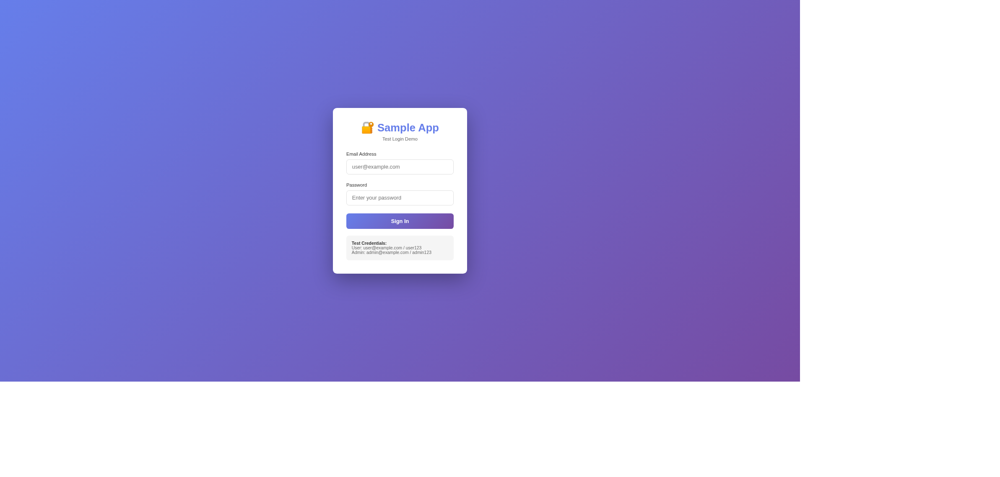
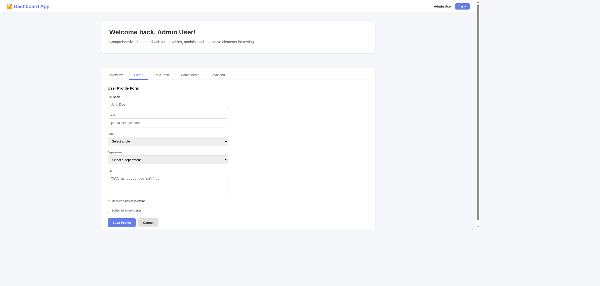
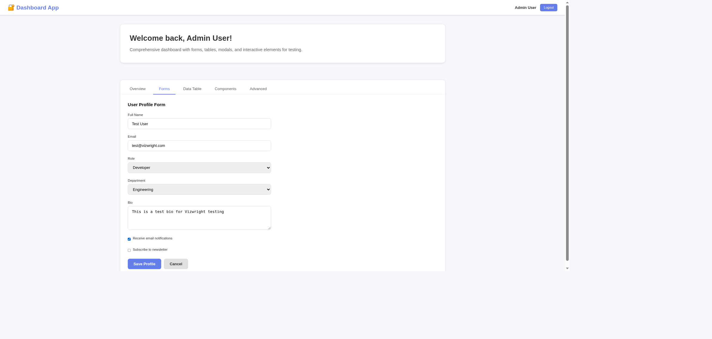
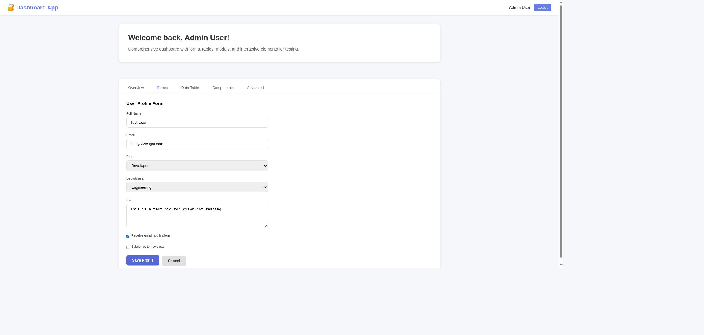
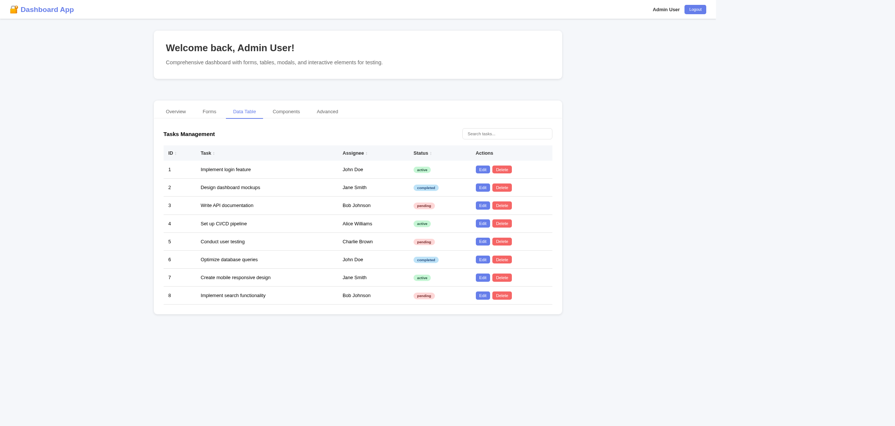
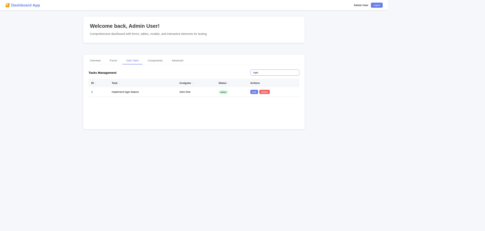

# How to Test Vizwright

## Using Sample Apps for Development & Validation

Vizwright uses **sample applications** as its testing ground. These are real web apps that live in
`sample-apps/` and serve as both development targets and validation environments. Think of them as
"known good" test subjects that let us prove Vizwright works before pointing it at real user
applications.

---

## The Dashboard Sample App Journey

The `sample-apps/dashboard/` provides a complete web application with authentication, forms, tables,
and interactive UI components. Below is the complete user journey captured during test exploration:

### 🔐 Authentication Flow: Login → Credentials → Access

|                  Step 1: Initial Login                   |                     Step 2: Credentials Entered                      |
| :------------------------------------------------------: | :------------------------------------------------------------------: |
|      |  |
| Test identifies login form with username/password fields |       Credentials entered (`admin/admin123`), ready to submit        |

### 📊 Dashboard Navigation: Landing → Overview → Feature Tabs


**Step 3:** Successful authentication reveals the dashboard with metrics cards, navigation tabs, and
data visualization—tests verify all UI elements render correctly.

### 📝 Form Interactions: Fill → Validate → Submit → Confirm

|         Step 4: Navigate to Forms          |            Step 5: Fill All Fields             |                  Step 6: Verify Success                   |
| :----------------------------------------: | :--------------------------------------------: | :-------------------------------------------------------: |
|  |  |  |
|             Forms tab selected             |          Complete form with test data          |            Green success notification appears             |

### 🔍 Data Operations: Browse → Search → Filter Results

|            Step 7: Data Table Loaded            |                         Step 8: Search Filtered                         |
| :---------------------------------------------: | :---------------------------------------------------------------------: |
|     |            |
| Table displays with sortable columns and search | Search filters data in real-time (e.g., "Alice" shows matching records) |

---

## What Each Journey Tests

| Journey Phase      | What Vizwright Validates                                                  |
| ------------------ | ------------------------------------------------------------------------- |
| **Authentication** | Form detection, input filling, button clicks, navigation on success       |
| **Dashboard**      | Element rendering, state transitions, tab navigation, metrics display     |
| **Forms**          | Multi-field input, validation feedback, submit actions, success messaging |
| **Data Tables**    | Dynamic content, search/filter functionality, result accuracy             |

---

## Why Sample Apps Matter

**Sample apps are NOT toy examples**—they're full-fledged applications that exercise Vizwright's
core capabilities:

- **Realistic complexity**: Authentication, state management, CRUD operations
- **Reproducible**: Same app state every time, making tests deterministic
- **Safe**: Developers can experiment without breaking production systems
- **Fast feedback**: Local apps (no network latency), instant validation

When you see a test running against the dashboard, it's proving that Vizwright can:

1. **Discover** UI elements intelligently (buttons, inputs, tables)
2. **Interact** with them (click, type, select)
3. **Verify** outcomes (success messages, filtered data, navigation)
4. **Capture intent** (not brittle selectors, but meaningful actions)

---

## Running Tests Against Sample Apps

```bash
# Start the sample app server
cd sample-apps
./serve.sh

# In another terminal, run Vizwright tests
deno task dev:backend  # Starts API on :3000
deno task dev:frontend # Starts UI on :5173

# Navigate tests to http://localhost:8000/dashboard/
```

Tests written in Vizwright's DDL (YAML) reference these apps by URL, making them portable across
environments (local dev, CI, staging, prod).

---

## The Testing Philosophy

Traditional test frameworks capture **brittle selectors** like `#btn-submit-form-2`. Vizwright
captures **intent** like "click the submit button on the registration form." Sample apps prove this
works—the same test definition runs even when the DOM structure changes, because Vizwright
re-discovers elements intelligently based on their semantic meaning.

That's why these screenshots matter: they show **real interactions** that Vizwright orchestrates,
not scripted sequences that break when a CSS class changes.
